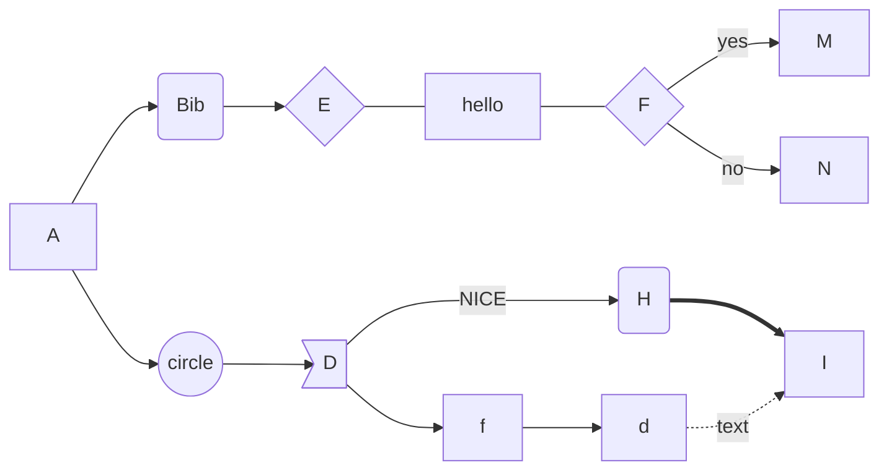
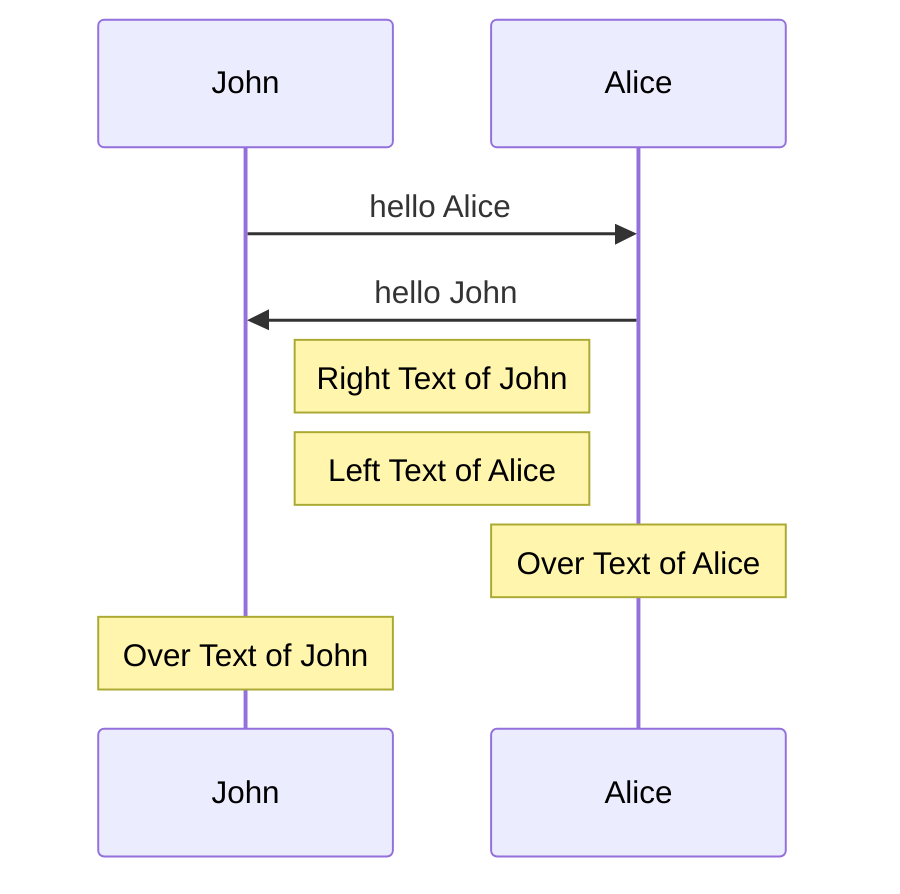

# typora使用笔记

---

1. **常用快捷键**
   - **加粗**：`ctrl  b`
   - **斜体**：`ctrl  i`
   - **标题**：`shift  # `一共六级，相应增加#个数
   - **下划线**：`ctrl  u`
   - **删除线**：`alt  shift  5`
   - **引用**：>
   - **高亮**：==  ==
   - **插入表格**：`ctrl  t`
   - **插入公式**：`ctrl  shift  m`
   - **插入代码块**：`ctrl  shift  k`
   - **插着重关键字**：ctrl  shift  `
   - **插入图片和视频**：直接拖入
   - **有序列表**：1 + . + 空格
   - **无序列表**：-
   - **标题改段落**：`ctrl  0`
   - **插入链接**：直接复制
   - **目录**：`[toc]`
   - **按行选择**：`ctrl  l`
   - **按单词选择**：`ctrl  d`
   - **提升标题等级**：`ctrl  +`
   - **降低标题等级**：`ctrl  -`
   - **分割线**：`***`
   - **脚注**：`[内容^1]`
   - **切换代码模式和预览模式**：`ctrl  /`
   - **超链接**：`ctrl  k`
   - **任务列表**：- + 空格 + [空格] + 空格 + 内容
   - **表情**： ： + 表情关键词

    - **上标、下标、内嵌公式：需要在设置里先勾选**
      - **上标**：^
      - **下标**：~
        - **公式**：$/公式$
   - **专注模式**：`F8`
   - **打字模式**：`F9`
   - **切换全屏**：`F11`

2. **`Flow`流程图**

**语法分为两个部分：1. 先声明流程图元素含义      2. 指定流程图指向**

  ```flow
   st=>start: 开始
   e=>end: 结束
   c1=>condition: 条件A?
   c2=>condition: 条件B?
   c3=>condition: 条件C?
   io=>inputoutput: 输出结果
   e1=>subroutine: 保存本地文件
   e2=>operation: 发送客户邮件:>https://www.mallai.top
   st->c1(no)->e
   c1(yes,right)->c2
   c2(no)->e
   c2(yes,right)->c3
   c3(no)->e
   c3(yes,right)->io
   io->e1
   e1->e2
   e2(left)->e
  ```


3. **`mermaid`流程图**

| 声明元素     | 含义                         |
| ------------ | ---------------------------- |
| TB/TD        | 从上到下                     |
| BT           | 从下到上                     |
| RL           | 从右到左                     |
| LR           | 从左到右                     |
| id           | 默认为正方形，id为元素内文本 |
| id[  ]       | 正方形                       |
| id(  )       | 圆角正方形                   |
| id((  ))     | 圆形                         |
| id>  ]       | 半方框                       |
| id{  }       | 条件判断框                   |
| -->          | 实线箭头                     |
| ---          | 实线无箭头                   |
| --text---    | 实线无箭头注释               |
| --> \|text\| | 实线箭头注释                 |
| -.-          | 虚线箭头                     |
| -. text .->  | 虚线箭头注释                 |
| -.text .-    | 虚线注释                     |
| ==>          | 实线箭头加粗                 |
| == text ==>  | 实线箭头加粗注释             |




4. **`mermaid`时序图**

 - **声明**：

   ```
   sequenceDiagram
       participant A as Alice  # 声明先后顺序
       participant J as John
       A->>J: Hello John, how are you?
       J->>A: Great!
   ```

- 解释

  | ->   | 无箭头实线  |
  | ---- | ----------- |
  | -->  | 无箭头虚线  |
  | ->>  | 有箭头实线  |
  | -->> | 有箭头虚线  |
  | -x   | 实线末端带x |
  | --x  | 虚线末端带x |




5. **`Latex`数学公式整理**

 - **行内插入**

   这是公式：$a + b$

- **另起一行**
  $$
  a + b
  $$

- **上、下标**
  $$
  x_{22}^{(n)}
  $$

- **分式**
  $$
  \frac{1}{1 + \frac{1}{2}}
  $$

- **根式**
  $$
  \sqrt{1 + \sqrt[^p\!]{a + a^2}}
  $$

  - [ ]代表几次根
  - { }代表根号下的表达式

- **求和、记分**
  $$
  \sum_{k=1}^{n}\frac{1}{k}
  \int_a^bf(x)dx
  $$

- **空格**

  - 紧贴   $a\!b$
  - 没有空格   $ab$
  - 小空格   $a\,b$
  - 中等空格   $a\;b$
  - 大空格   $a\ b$
  - quad空格   $a\quad b$
  - 两个quad空格   $a\qquad b$

  $$
  \int_a^bf(x)\,\mathrm{d}x
  $$

- **公式界定符**
  $$
  \left(\sum_{k=\frac{1}{2}}^{N^2}\frac{1}{k}\right)
  $$

  - 通过`\left`和`\right`来界定公式

- **矩阵**

  - begin   end  &   \\\\\\

  $$
  \begin{Vmatrix}1 & 2\\\\3 & 4\end{Vmatrix}
  $$

  $$
  \begin{pmatrix}1 & 2\\\\3 & 4\end{pmatrix}
  $$

$$
\begin{bmatrix}1 & 2\\\\3 & 4\end{bmatrix}
$$

$$
\begin{Bmatrix}1 & 2\\\\3 & 4\end{Bmatrix}
$$

$$
\begin{vmatrix}1 & 2\\\\3 & 4\end{vmatrix}
$$

  - 排版数组
    $$
    \mathbf{X} = 
    \left(\begin{array}{ccc}
    x\_{11} & x\_{12} & \ldots \\\\
    x\_{21} & x\_{22} & \ldots \\\\
    \vdots & \vdots & \ddots
    \end{array} \right) 
    $$

- 多行公式
  $$
  \begin{aligned}
  x ={}& a+b+c+{} \\\\
  &d+e+f
  \end{aligned}
  $$

- 公式组
  $$
  \begin{align}
  a &= b+c+d \\\\
  x &= y+z
  \end{align}
  $$

- 分段函数
  $$
  y=\begin{cases}
  -x,\quad x\leq 0 \\\\
  x, \quad x>0
  \end{cases}
  $$

- 划线
  $$
  \left(\begin{array}{|c|c|}
  1 & 2 \\\\
  \hline
  3 & 4
  \end{array}\right)
  $$

- 希腊字符
  $$
  \begin{array}{|c|c|c|c|c|c|c|c|}
  \hline
  {\alpha} & {\backslash alpha} & {\theta} & {\backslash theta} & {o} & {o} & {\upsilon} & {\backslash upsilon} \\\\
  \hline
  {\beta} & {\backslash beta} & {\vartheta} & {\backslash vartheta} & {\pi} & {\backslash pi} & {\phi} & {\backslash phi} \\\\
  \hline
  {\gamma} & {\backslash gamma} & {\iota} & {\backslash iota} & {\varpi} & {\backslash varpi} & {\varphi} & {\backslash varphi} \\\\
  \hline
  {\delta} & {\backslash delta} & {\kappa} & {\backslash kappa} & {\rho} & {\backslash rho} & {\chi} & {\backslash chi} \\\\
  \hline
  {\epsilon} & {\backslash epsilon} & {\lambda} & {\backslash lambda} & {\varrho} & {\backslash varrho} & {\psi} & {\backslash psi} \\\\
  \hline
  {\varepsilon} & {\backslash varepsilon} & {\mu} & {\backslash mu} & {\sigma} & {\backslash sigma} & {\omega} & {\backslash omega} \\\\
  \hline
  {\zeta} & {\backslash zeta} & {\nu} & {\backslash nu} & {\varsigma} & {\backslash varsigma} & {} & {} \\\\
  \hline
  {\eta} & {\backslash eta} & {\xi} & {\backslash xi} & {\tau} & {\backslash tau} & {} & {} \\\\
  \hline
  {\Gamma} & {\backslash Gamma} & {\Lambda} & {\backslash Lambda} & {\Sigma} & {\backslash Sigma} & {\Psi} & {\backslash Psi} \\\\
  \hline
  {\Delta} & {\backslash Delta} & {\Xi} & {\backslash Xi} & {\Upsilon} & {\backslash Upsilon} & {\Omega} & {\backslash Omega} \\\\
  \hline
  {\Omega} & {\backslash Omega} & {\Pi} & {\backslash Pi} & {\Phi} & {\backslash Phi} & {} & {} \\\\
  \hline
  \end{array}
  $$

- 特殊字符

  | 版权     | &copy;  |
  | -------- | :------ |
  | 注册商标 | &reg;   |
  | 商标     | &trade; |
  | 不等号   | &ne;    |
  | 小于等于 | &le;    |
  | 大于等于 | &ge;    |
  | 分       | &cent;  |
  | 英镑     | &pound; |
  | 欧元     | &euro;  |
  | 节       | &sect;  |

- 常用函数写法

  | 正弦函数   | \sin(x)           | 对数函数   | \log(x)    |
  | ---------- | ----------------- | ---------- | ---------- |
  | 累乘       | \displaystyle     | 底部省略   | \ldots     |
  | 中部省略   | \cdots            | 积分       | \int       |
  | 极限函数   | \lim              | 箭头       | \to        |
  | 矢量       | \vec{a}           | 度数       | 90^\circ   |
  | 上箭头     | \uparrow          | 双上箭头   | \Uparrow   |
  | 偏导       | \partial y        | 无穷       | \infty     |
  | 平方根     | \sqrt             | 上划线     | \overline  |
  | 下划线     | \underline(a + b) | 上括号     | \overbrace |
  | 下括号     | \underbrace       | 正负号     | \pm        |
  | 负正号     | \mp               | 乘号       | \times     |
  | 点乘       | \cdot             | 星乘       | \ast       |
  | 除法       | \div              | 分式       | \frac      |
  | 小于等于   | \leq              | 非         | \not       |
  | 大于等于   | \geq              | 不等于     | \neq       |
  | 不小于等于 | \nleq             | 不大于等于 | \ngeq      |
  | 相关符号   | \sim              | 约等于     | \approx    |
  | 恒等于     | \dquiv            | 加运算符   | \bigodot   |
  | 乘运算符   | \bigotimes        | 严格优于   | \succ      |
  | 优于       | succeq            | 严格不优于 | \prec      |
  | 不优于     | \preceq           | 偏好相等   | \sim       |

- 集合符号

  | 属于   | \in          |
  | ------ | ------------ |
  | 不属于 | \notin       |
  | 真子集 | \subset      |
  | 非子集 | \not \subset |
  | 子集   | \supset      |
  | 超集   | \supset      |
  | 超集   | \supseteq    |
  | 并集   | \cup         |
  | 交集   | \cap         |
  | 实数集 | \mathbb{R}   |
  | 空集   | \lemptyset   |

  


