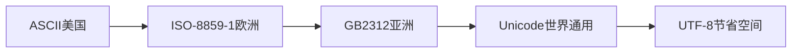

# 编码问题

> 这部分内容是直接从网站上复制过来的，关于编码问题对于初学者来说还真是很头疼额！！！
>
> 用起来还是很模糊

---

相信计算机专业的都知道，所有的数据（文本，音频，视频等等）在计算机内部都是以二进制形式来表示的。而计算机内部为什么采用二进制则是由硬件决定的（计算机采用了具有两种稳定状态的二值电路）。这样，就引出一个问题：
**我们人类不适合直接看二进制。**因此，需要用一种方法，将二进制转为我们能看懂的东西。**编码就应运而生了。**

## 编码发展历史

### 第一阶段：

在计算机中，所有的数据只可能是`0`或者`1`(用高电平和低电平分别表示`1`和`0`)，那么我们通常看到的字符也就只能用`0`和`1`来表示。于是科学家们(这里指的是美国的科学家)就想出一个办法，把一个特定的数字对应一个特定的字母进行存储和传输，比如我需要存储字母`a`，那么我存入一个数字`97`(即在计算机中存入二进制`(01100001)`，这个过程叫做编码`(encode)`，而我们在读取数据的时候，当遇到`97`时，我们就让计算机显示字母a，这个过程叫做解码`(decode)`。

**这里你应该知道：**

> 计算机看懂的东西我们看不懂，我们看懂的东西，计算机看不懂。

把计算机看懂的东西（二进制`(01100001)`）变成我们看懂的东西（数字`97`，也就是`a`），这个过程叫解码`（decode）`
把我们看懂的东西（数字`97`，也就是`a`）变成计算机看懂的东西（二进制`(01100001)`），这个过程叫做编`（encode）`为了大家在数据传输的时候不至于产生误会，那么我们需要让所有的人都使用数字`97`来代表字母`a`，所以需要制定一份标准(即码表)，最开始的这个标准叫做`ASCII`码表。最早的计算机在设计时采用8个比特`（bit）`作为一个字节`（byte）`，所以，一个字节能表示的最大的整数就是`255`（二进制`11111111`=十进制`255`）。由于计算机是美国人发明的，因此，最早只有`127`个字符被编码到计算机里（即用一个字节的后七位），也就是大小写英文字母、数字和一些符号，这个编码表被称为`ASCII`编码，比如大写字母`A`的编码是`65`，小写字母`z`的编码是`122`。

### 第二阶段：

随着发展，计算机开始普及，当计算机流传到欧洲时，**问题再次出现，原本的`ASCII`编码只能解决美国人的编码问题，无法将欧洲的文字表示出来**。于是乎，欧洲人就把`ASCII`码中没用到的第一位**给用了**，即：

1. `ASCII`码用一个字节的后七位，表示范围是`0-127`；
2. 欧洲人把这个字节的第一位也用了，表示范围`0-255`。除去原本的`0-127`，剩下`128-255.128-159`之间为控制字符，`160-255`位文字符号，其中包括了西欧语言、希腊语、泰语、阿拉伯语、希伯来语。砖家们决定把他们的编码名称叫做`Latin1`，后面由于欧洲统一制定`ISO`标准，所以又有了一个`ISO`的名称，即`ISO-8859-1`。

### 第三阶段

计算机技术当然也传到了亚洲大地，比如中国。原本的一个字节的8个位全都用完了，但是要处理中文显然一个字节是不够的，至少需要两个字节，而且还不能和`ASCII`编码冲突，所以，中国制定了`GB2312`编码，用来把中文编进去。

**问题又来了：**

> 你可以想得到的是，全世界有上百种语言，日本把日文编到`Shift_JIS`里，韩国把韩文编到`Euc-k`r里，各国有各国的标准，就会不可避免地出现冲突，结果就是，在多语言混合的文本中，显示出来会有乱码。

**因此，`Unicode`应运而生。`Unicode`把所有语言都统一到一套编码里，这样就不会再有乱码问题了。**

到了这里：已经知道的编码方式**主要**有两种：`ASCII`和`Unicode`

现在，捋一捋`ASCII`编码和`Unicode`编码的区别：`ASCII`编码是1个字节，而`Unicode`编码通常是2个字节。(如果要用到非常偏僻的字符，就需要4个字节)

- 字母`A`用`ASCII`编码是十进制的65，二进制的`01000001`；
- 字符'0'用`ASCII`编码是十进制的48，二进制的`00110000`，注意字符'0'和整数0是不同的；
- 汉字`中`已经超出了`ASCII`编码的范围，用`Unicode`编码是十进制的`20013`，二进制的`01001110 00101101`。

**你可以猜测，如果把`ASCII`编码的`A`用`Unicode`编码，只需要在前面补0就可以，因此，`A`的`Unicode`编码是`00000000 01000001`。**

**新的问题又出现了**：

> 如果统一成`Unicode`编码，乱码问题从此消失了。但是，如果你写的文本基本上全部是英文的话，用Unicode编码比ASCII编码需要多一倍的存储空间，在存储和传输上就十分不划算。

所以，本着节约的精神，**又出现了把`Unicode`编码转化为“可变长编码”的`UTF-8`编码。**

- `UTF-8`编码把一个`Unicode`字符根据不同的数字大小编码成`1-6`个字节，常用的英文字母被编码成1个字节，汉字通常是3个字节，只有很生僻的字符才会被编码成`4-6`个字节。如果你要传输的文本包含大量英文字符，用`UTF-8`编码就能节省空间。

| 字符 | ASCII    | Unicode           | UTF-8                      |
| ---- | -------- | ----------------- | -------------------------- |
| A    | 01000001 | 00000000 01000001 | 01000001                   |
| 中   | x        | 01001110 00101101 | 11100100 10111000 10101101 |

从上面的表格还可以发现，`UTF-8`编码有一个额外的好处，就是`ASCII`编码实际上可以被看成是`UTF-8`编码的一部分，所以，大量只支持`ASCII`编码的历史遗留软件可以在`UTF-8`编码下继续工作。



## `ASCII`,`Unicode`,`utf-8`之间的关系

看完上面的东西，可能有点乱，我这里简单总结一下`ASCII,Unicode,utf-8`之间的关系：

1. `ASCII`是计算机刚刚起步的时候用得编码方式，特点是可以表示的字符特别少，但简单易用。
2. `Unicode`是随着计算机发展，`ASCII`已经无法表示世界各国这么多文字而出现的一个新的编码方式，优点是编码快速，缺点是占用内存大。（如果你的文本全都是英语，如果用`Unicode`时，每个字符占用两个字节。而用`ASCII`每个字符只占用一个字节）；
3. 为了解决`Unicode`的内存占用大问题，出现了`utf-8`,`utf-8`可以根据字符的类型，自动选择最优编码。但缺点是编码速度慢。

**所以有了令人容易搞混的问题出现：**

> 什么时候用`utf-8`（这里`utf-8`已经包括`ASCII`，`ASCII`编码实际上可以被看成是`UTF-8`编码的一部分）编码方式？什么时候用`Unicode`编码方式？

## 什么时候用`utf-8`编码？

答案很显然：对内存消耗要求高的，对速度要求不高的场景下用`utf-8`。（注意：这里的速度是指`cpu`运算速度）
那你就想啊，什么时候对内存消耗要求高？很容易地就想到当我们要保存在硬盘的时候肯定是想占用空间越少越好啊，当我们在网络上传输肯定也想占用空间越少越好啊，**所以，当我们的数据保存在硬盘的时候，当我们数据要在网络传输的时候，用得就是`utf-8`编码。**

## 什么时候用`Unicode`?

答案显然：对速度要求特别高的，相对之下占用空间大小可以稍微妥协的场景下用`Unicode`编码。
我们知道，数据想被处理，首先得加载都内存上，这样，`cpu`才能以非常惊人的速度再内存上获取要处理的数据。这样，我们就轻易知道，当数据被加载到内存上时，在内存中的编码方式是`Unicode`。

我们来个总结：

1. 我们平时电脑磁盘中的一个文件（`abc.txt`）其实是以`utf-8`编码方式存储的，当我们打开这个文件时，这个文件在加载到内存的时候会转变为`Unicode`编码方式。
   
2. 浏览网页的时候，服务器会把动态生成的`Unicode`内容转换为`UTF-8`再传输到浏览器（所以你看到很多网页的源码上会有类似的信息，表示该网页正是用的`UTF-8`编码。）：
   

## `Python`字符串

在最新的`Python 3`版本中，**字符串**是以**`Unicode`编码**的，也就是说，`Python`的字符串支持多语言。这里，我重现这句话：**在`python`中，字符串是以`Unicode`编码的**。这句话的一个重要的地方是：**字符串**,例如：
`print("这句话是使用Unicode编码的，支持多语言，比如English.")`
这句话是使用`Unicode`编码的，支持多语言，比如`English`.

解释：`print`函数输出的这句话在`python`里是使用`Unicode`编码的（当然它此时也在内存中，因为它现在正被加载着嘛）

------

那我想看看以`utf-8编码`方式输出的时候是什么样的，怎么做？很简单，`encode`函数接受一个参数，这个参数可以指定以什么方式编码！看：

```python
>>> "这句话是使用Unicode编码的，支持多语言，比如English.".encode('utf-8')
b'\xe8\xbf\x99\xe5\x8f\xa5\xe8\xaf\x9d\xe6\x98\xaf\xe4\xbd\xbf\xe7\x94\xa8Unicode\xe7\xbc\x96\xe7\xa0\x81\xe7\x9a\x84\xef\xbc\x8c\xe6\x94\xaf\xe6\x8c\x81\xe5\xa4\x9a\xe8\xaf\xad\xe8\xa8\x80\xef\xbc\x8c\xe6\xaf\x94\xe5\xa6\x82English.'
```

看这个输出十分有趣，**首先，输出是以`b`开头的，说明这是一段`bytes`。（`bytes`的作用请看下去）**有没有想起在前面说过的`utf-8`是向下兼容`ASCII`码的？你看输出中的英文`Unicode`和`English`就被原样输出，而`ASCII`码不能识别的中文，则用`utf-8`编码方式来表示，如`\xe8`,`\xbf`等等。

那`Unicode`编码方式用得好好的，可以直接混合输出英文和中文等多种语言，换成`utf-8`输出字符只有英文能让我们看懂，中文变成了难以分辨的**十六进制**（`\xe8\xbf\x99\xe5\x8f\xa5\xe8...`），我们为什么还要有`utf-8`编码方式呢？
想到这个问题说明你已经`get`到点了。你想，`utf-8`编码方式的优点是什么？
**就是省内存啊**
那么，由于`Python`的字符串类型是`str`，**在内存中以`Unicode`编码的，一个字符对应若干个字节**。如果要在网络上传输，或者保存到磁盘上，就需要把**`Unicode`编码的`str`变为以字节为单位的`bytes`，**而通过`utf-8`编码或者`ASCII`码编码生成的结果**就是以字节为单位的`bytes`**。
这句话这么长无非就重复一个观点：

> `python`中的`str`是以`Unicode`编码的（注意，既然我们能看到`str`,说明这个python文件已经被打开了，即已经加载到内存上），如果要在网络上传输，或者保存到磁盘上，就得转换为`utf-8`编码方式。

------

这里，我通过讲解三个例子，你们体会体会：

```python
>>> 'I love computer'.encode('ascii')
b'I love computer'
```

解释：由于'I love computer'是纯英语，所以可以用`ASCII`编码。
再看：`I love computer`和`b'I love computer`有什么不同？没错，多了一个`b`。这个`b`大有玄妙之处：

1. `I love computer`是`python`中的`str`,是以`Unicode`方式编码的。
2. `b'I love computer`也是`python`中的`str`，但它是以`ASCII`码编码的。

那能不能用`utf-8`编码`I love computer`呢？答案显然（`ASCII`编码实际上可以被看成是`UTF-8`编码的一部分）:

```python
>>> 'I love computer'.encode('utf-8')
b'I love computer'
```

好了，前面是对纯英文的`str`进行编码，那对中文的`str`编码呢？可以对中文的`str`进行`utf-8`编码，不能进行`ASCII`码编码（为什么呢？自己想吧）：

```python
>>> '我喜欢计算机'.encode('utf-8')
b'\xe6\x88\x91\xe5\x96\x9c\xe6\xac\xa2\xe8\xae\xa1\xe7\xae\x97\xe6\x9c\xba'
>>> '我喜欢计算机'.encode('ascii')
Traceback (most recent call last):
  File "<stdin>", line 1, in <module>
UnicodeEncodeError: 'ascii' codec can't encode characters in position 0-5: ordinal not in range(128)
```